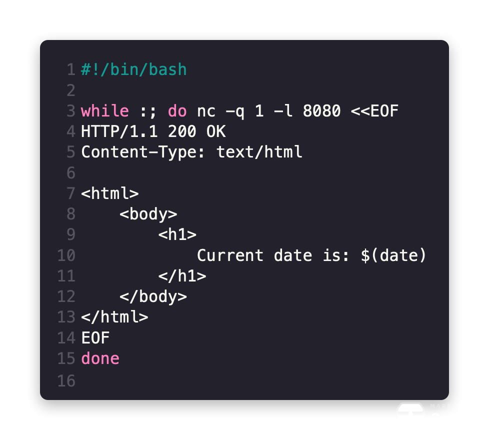

# bash-webserver

[](https://github.com/elulcao/bash-webserver/actions/workflows/github-registry.yaml)
[](https://github.com/elulcao/bash-webserver/actions/workflows/docker-registry.yaml)


---

<p
    align="center">
    
</p>

---

Small bash web server that displays the current date

## Usage

Build the server: `docker build -t bash-webserver .`

Execute the server: `docker run -d -p 80:8080 bash-webserver`

```bash
➜ ~ docker run -d -p 80:8080 server

GET / HTTP/1.1
Host: localhost
User-Agent: curl/7.77.0
Accept: */*
```

Check the server: `curl localhost:80`

```bash
➜ ~ curl localhost
<html>
    <body>
        <h1> Current date is: Sun Jan  9 04:21:47 UTC 2022 </h1>
    </body>
</html>
```

## Install from the command line

### GitHub Container Registry

```bash
docker pull ghcr.io/elulcao/bash-webserver:latest
```

### Docker Hub

```bash
docker pull docker.io/elulcao/bash-webserver:latest
````
